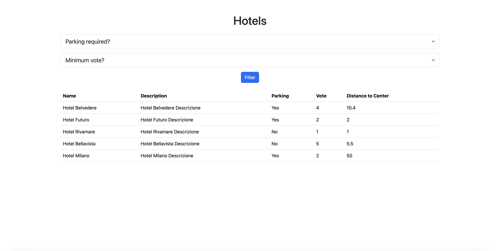

# PHP Hotel

This project is a simple filter for data about hotels.  

The data is printed into the DOM with a "foreach" loop.
The filter itself is a form sending a "GET" request. We then use "if" conditions to display only certain hotels based on the chosen conditions.